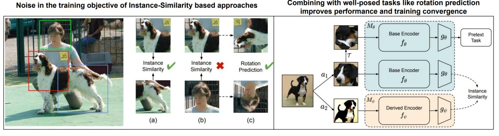

# Efficient and Effective Self-Supervised Learning

This repository contains the implementation of our paper titled "Towards Efficient and Effective Self-Supervised Learning of Visual Representations", accepted at [ECCV'22](https://eccv2022.ecva.net/) [[Poster](https://drive.google.com/file/d/1tW40PWQNcMx1W3JSyghD0-ym8BrS_iDP/view)][[Paper](https://arxiv.org/abs/2210.09866)][[Video](https://drive.google.com/file/d/1c7348_9Le0ZfLaVMjeh2UeyH9OyeVqgl/view)]. A preliminary version of our work was presented at the NeurIPS'21 Workshop, [Self-supervised learning, Theory and Practice](https://sslneurips21.github.io/) [[Poster](https://sslneurips21.github.io/files/Poster/Paper_id_25.pdf)][[Paper](https://sslneurips21.github.io/files/CameraReady/SSLW_upload.pdf)].



 # Requirements
* Python 3.8.8
* PyTorch 1.7.1
* tqdm

# Training and Evaluation
Please check the training scripts provided under the [scripts](https://github.com/val-iisc/EffSSL/tree/main/scripts) folder to train the base model (SwAV) and ours (SwAV+Rotnet), followed by linear evaluation.

# Citation
If you use our code in your research, please cite the following:
```
@inproceedings{
EffSSL22,
title={Towards Efficient and Effective Self-Supervised Learning of Visual Representations},
author={Sravanti Addepalli and Kaushal Santosh Bhogale and Priyam Dey and Venkatesh Babu Radhakrishnan},
booktitle={European Conference on Computer Vision 2022},
year={2022}
}
```

# Licence
This source code is released under the MIT license, included [here](https://github.com/val-iisc/EffSSL/blob/main/LICENSE).

This project also borrows code from [SwAV official repository](https://github.com/facebookresearch/swav), also [MIT Licensed](https://github.com/facebookresearch/swav/blob/main/LICENSE).
